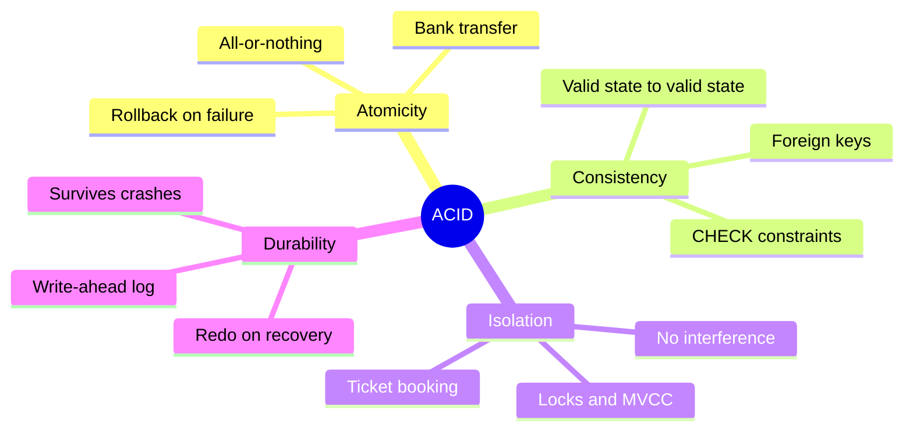
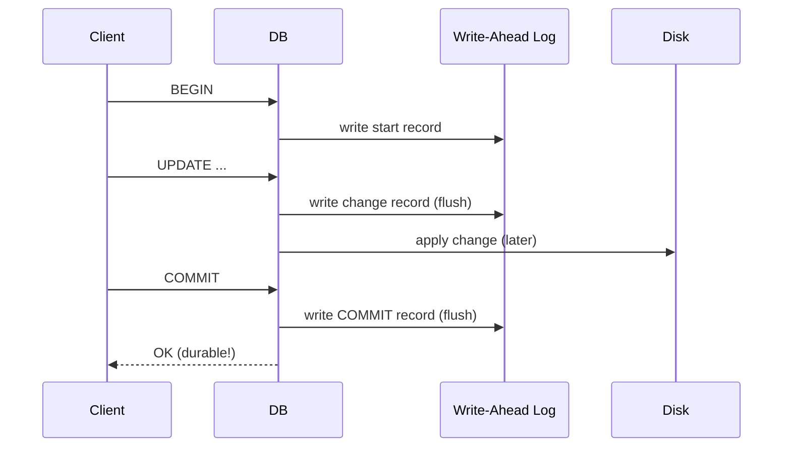
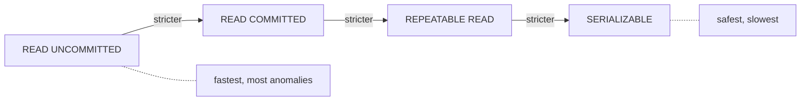
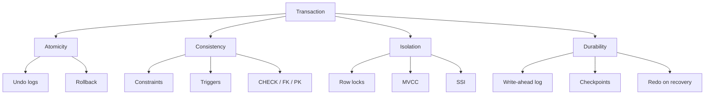
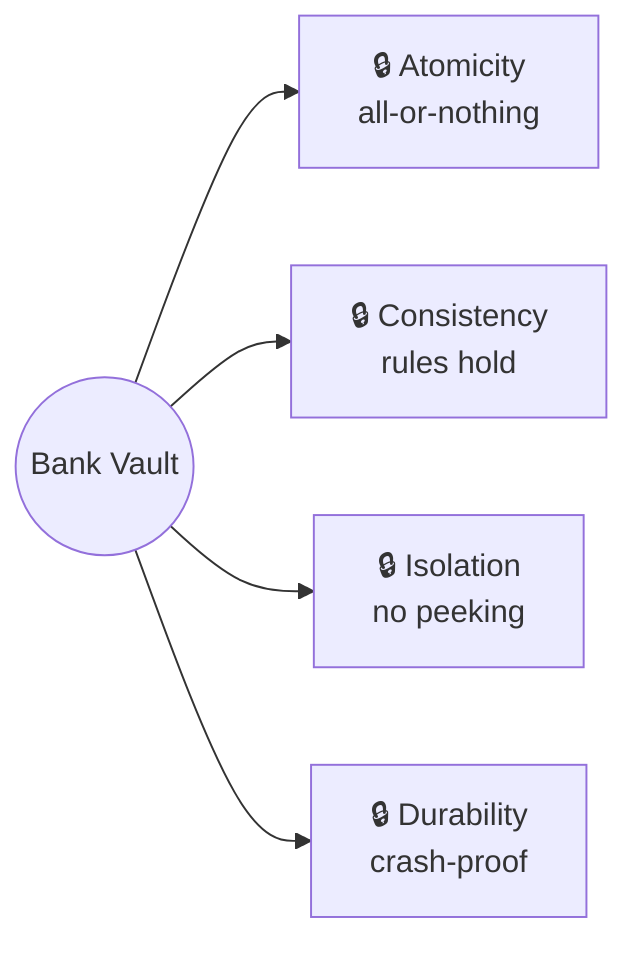

# ACID Visual Diagram

Rendered with [Mermaid](https://mermaid.js.org/). GitHub renders Mermaid natively in Markdown.

## The Four Properties at a Glance

## Transaction Lifecycle

## Isolation Levels (Trade-off)

## How Each Property Is Enforced

## The Bank Vault Analogy

